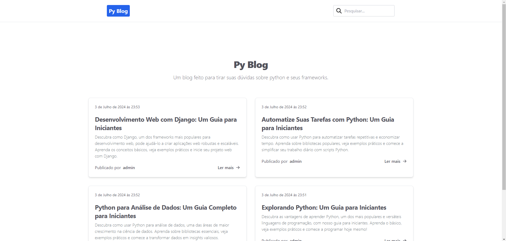
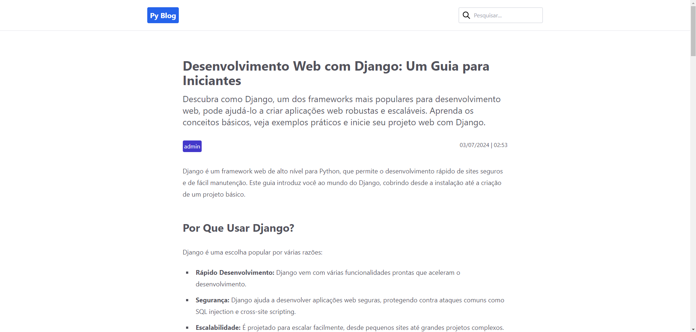

  <h1 align="center">Py Blog</h1>

Blog feito com Python, Django e Tailwind CSS.

  <a href="#-tecnologias">Tecnologias</a>&nbsp;&nbsp;&nbsp;|&nbsp;&nbsp;&nbsp;
  <a href="#-projeto">Projeto</a>&nbsp;&nbsp;&nbsp;|&nbsp;&nbsp;&nbsp;
  <a href="#memo-licença">Licença</a>

  

 

  
  

## 🚀 Tecnologias

Esse projeto foi desenvolvido com as seguintes tecnologias:

- Python
- Django
- HTML
- Tailwind CSS

## 💻 Projeto

Projeto de um blog feito com Python, Django e Tailwind CSS. O blog, através da página de administração
do Django, permite a formatação das publicações através do Tinymce, um editor de texto rich editor. Para o design foi utilizado
o framework css Tailwind, que permite a uma estilização personalizada e responsiva. Também permite a pesquisa de publicações específicas
atráves de uma barra de pesquisa.

## 📝 Licença

Esse projeto está sob a licença MIT.